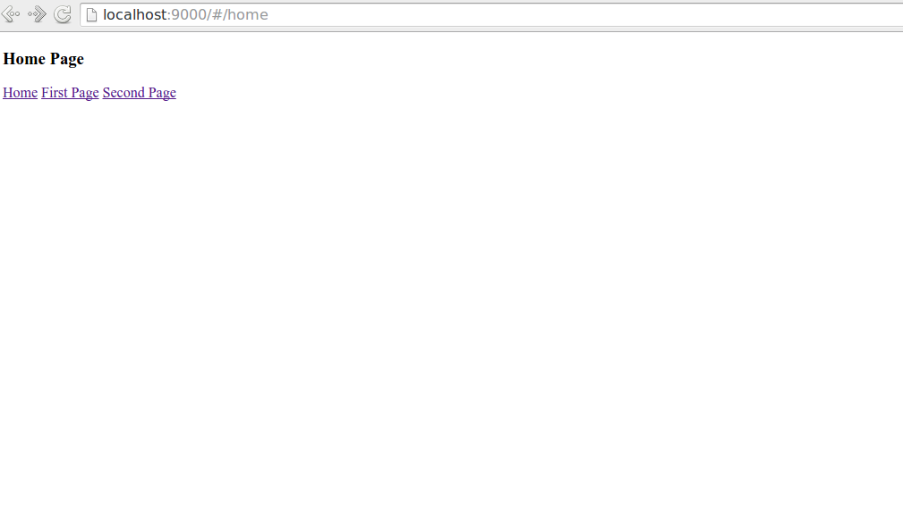

## beginner-amd

Beginner AMD is a sample angularAMD app. Its provide all structure necessary, include:
- [Unit Testing](#unit)
- [Build System](#build)
- [Editor Config](#editor)
- [Interface Testing - dalekjs](#interface)

# Install

```sh
$ bower install
```

```sh
$ npm install
```

# Getting started

```sh
$ grunt build
```

```sh
$ grunt start
```
## Thats all! See server running :smile:

